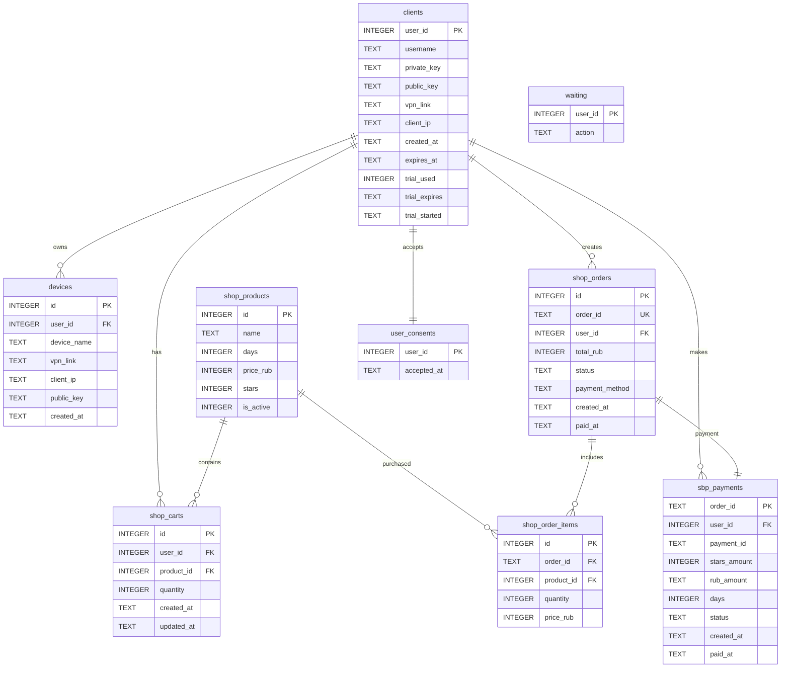

# ERD — Vepon VPN Service

## Overview

Vepon VPN использует единую базу данных **clients.db**, которая хранит информацию о пользователях, VPN-устройствах, магазине, заказах и платежах.

Такой подход позволяет избежать дублирования информации и объединяет весь функционал проекта в одной базе данных.

---

# Database Structure

```
clients.db
│
├── clients
├── devices
├── shop_products
├── shop_carts
├── shop_orders
├── shop_order_items
├── sbp_payments
├── user_consents
└── waiting
```

---

# Entity Relationship Diagram



---

# Tables

## clients

Основная таблица пользователей VPN.

| Field         | Description               |
| ------------- | ------------------------- |
| user_id       | Telegram ID (Primary Key) |
| username      | Telegram username         |
| private_key   | WireGuard private key     |
| public_key    | WireGuard public key      |
| vpn_link      | VPN configuration link    |
| client_ip     | Assigned VPN IP           |
| created_at    | Registration date         |
| expires_at    | Subscription expiration   |
| trial_used    | Trial already activated   |
| trial_started | Trial start date          |
| trial_expires | Trial expiration date     |

---

## devices

Дополнительные устройства пользователя.

Каждый пользователь может иметь несколько VPN-устройств с собственной конфигурацией.

| Field       | Description          |
| ----------- | -------------------- |
| id          | Primary Key          |
| user_id     | Client reference     |
| device_name | Device name          |
| vpn_link    | Device configuration |
| client_ip   | VPN IP               |
| public_key  | WireGuard public key |
| created_at  | Creation date        |

---

## shop_products

Каталог доступных VPN-подписок.

| Field     | Description           |
| --------- | --------------------- |
| id        | Product ID            |
| name      | Product name          |
| days      | Subscription duration |
| price_rub | Price in RUB          |
| stars     | Telegram Stars price  |
| is_active | Availability          |

---

## shop_carts

Корзина пользователя перед оформлением заказа.

| Field      | Description |
| ---------- | ----------- |
| user_id    | Client ID   |
| product_id | Product ID  |
| quantity   | Quantity    |
| created_at | Created     |
| updated_at | Updated     |

---

## shop_orders

История заказов.

| Field          | Description             |
| -------------- | ----------------------- |
| order_id       | Public order identifier |
| user_id        | Client ID               |
| total_rub      | Total amount            |
| status         | pending / paid          |
| payment_method | Payment method          |
| created_at     | Order creation          |
| paid_at        | Payment date            |

---

## shop_order_items

Товары, входящие в заказ.

| Field      | Description       |
| ---------- | ----------------- |
| order_id   | Order reference   |
| product_id | Product reference |
| quantity   | Quantity          |
| price_rub  | Price at purchase |

---

## sbp_payments

Информация о платежах.

| Field        | Description                 |
| ------------ | --------------------------- |
| order_id     | Payment order               |
| user_id      | Client                      |
| payment_id   | External payment ID         |
| stars_amount | Telegram Stars amount       |
| rub_amount   | Amount in RUB               |
| days         | Purchased subscription days |
| status       | Payment status              |
| created_at   | Creation time               |
| paid_at      | Payment confirmation        |

---

## user_consents

Фиксация согласия пользователя с условиями использования сервиса.

| Field       | Description          |
| ----------- | -------------------- |
| user_id     | Client ID            |
| accepted_at | Acceptance timestamp |

---

## waiting

Временная служебная таблица, используемая ботом для хранения текущего состояния пользователя во время выполнения сценариев.

| Field   | Description    |
| ------- | -------------- |
| user_id | Client ID      |
| action  | Current action |

---

# Business Logic

1. Пользователь авторизуется через Telegram.
2. При первом запуске создается запись в **clients**.
3. Пользователь принимает условия использования (**user_consents**).
4. Выбирает подписку (**shop_products**) и добавляет ее в корзину (**shop_carts**).
5. После оформления создается запись в **shop_orders** и **shop_order_items**.
6. При успешной оплате информация сохраняется в **sbp_payments**.
7. VPN-подписка создается или продлевается, обновляется поле **expires_at**, а при необходимости создаются дополнительные записи в **devices**.

---

# Design Principles

* Единая база данных SQLite (`clients.db`)
* Отсутствие дублирования данных
* Централизованное хранение пользователей и VPN-конфигураций
* Поддержка нескольких устройств для одного пользователя
* Интеграция магазина и платежной системы в будущем
* Простые связи между сущностями и удобная масштабируемость
